# The Actuarial Orchestrator — Requirements & Specifications

> **Platform:** Konecta Actuarial Orchestrator
> **Module:** [Actuarial Pricing Dashboard](https://github.com/eltaweelactuary/actuarial-pricing-dashboard)
> **Author:** Ahmed Eltaweel | Presales Engineer
> **Date:** February 2026

---

## 1. Platform Overview

An AI-powered platform for enhanced End-to-End (E2E) Actuarial Management, designed to boost:

- **Operational Efficiency** — streamlined workflows with automated orchestration
- **Real-Time Visibility** — live task execution tracking and seamless cross-system coordination
- **Collection Rate & Time** — accelerated debt recovery and reduced cycle times
- **Acquisition Quality** — improved risk segmentation and reduced exposure

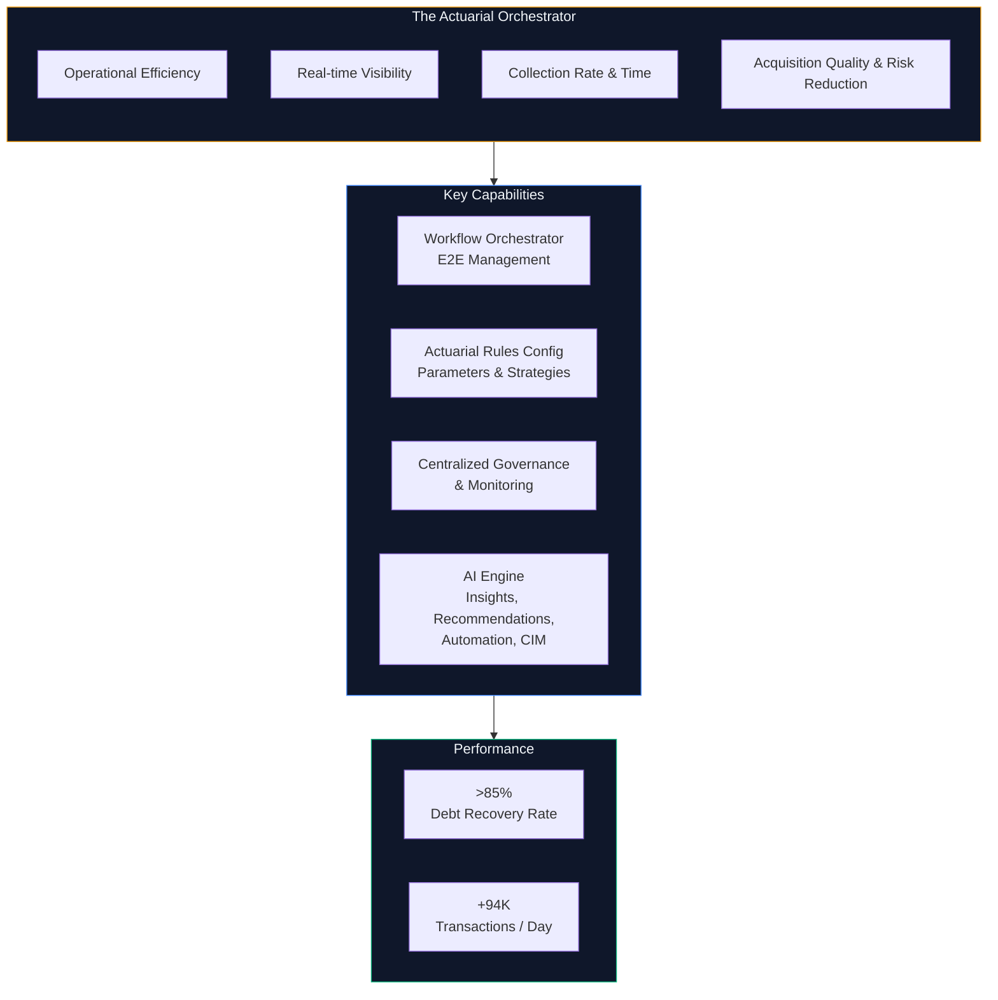

---

## 2. Governance & Actuarial Independence

> [!IMPORTANT]
> **The Actuarial Orchestrator does not override or modify any approved actuarial procedures.** The platform operates as a transparent, decision-support layer — not a decision-making layer.

### Our Approach

| Principle | Description |
|-----------|-------------|
| **Non-Interference** | All established actuarial methodologies, approved models, and regulatory procedures remain fully intact. The platform does not alter, bypass, or replace any approved departmental workflows. |
| **Assumption Extraction** | The engine extracts actuarial assumptions (loss distributions, mortality tables, expense ratios) directly from historical data and existing departmental records. No external assumptions are imposed. |
| **Expert-Driven Integration** | All extracted assumptions are validated and calibrated by the actuarial team before integration. The department's experience and professional judgment remain the ultimate authority. |
| **Full Transparency** | Every model output includes feature importance rankings, confidence intervals, and audit trails — ensuring complete visibility into how premiums are derived. |
| **Configurable Parameters** | All pricing loadings (expense, profit, contingency, reinsurance, commission) are manually adjustable by authorized actuaries. The engine applies them — it does not set them. |

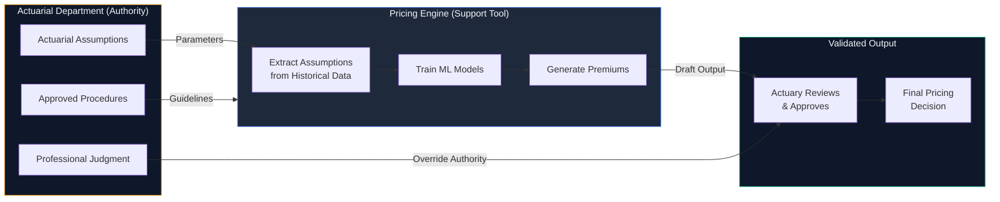

---

## 3. Pricing Engine Position in the Ecosystem

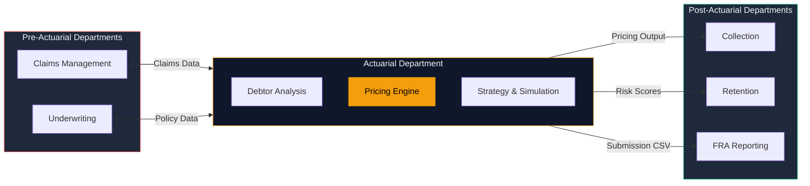

---

## 4. Customer Journey Flow

```mermaid
flowchart LR
    subgraph S1["1. Activation"]
        A1["Contract"]
        A1A["CVP + Scoring\n+ Clustering"]
    end

    subgraph S2["2. Prediction & Prevention"]
        A2["Education Campaign"]
        A2A["Direct Debit Push"]
    end

    subgraph S3["3. Onboarding"]
        A3["First Invoice"]
        A3A["Reminder & Support"]
    end

    subgraph S4["4. Assistance"]
        A4["Criticalities & Complaints"]
        A4A["Auto-matching"]
    end

    subgraph S5["5. Active Collection"]
        A5["Phone Collection"]
        A5A["Dedicated Team"]
    end

    subgraph S6["6. Retention"]
        A6["Aimed Outbound"]
        A6A["Plans & Suspension"]
    end

    subgraph S7["7. Closure"]
        A7["Automated Registration"]
    end

    S1 --> S2 --> S3 --> S4 --> S5 --> S6 --> S7

    style S1 fill:#1e40af,stroke:#3b82f6,color:#fff
    style S2 fill:#6d28d9,stroke:#8b5cf6,color:#fff
    style S3 fill:#047857,stroke:#10b981,color:#fff
    style S4 fill:#b45309,stroke:#f59e0b,color:#fff
    style S5 fill:#9f1239,stroke:#f43f5e,color:#fff
    style S6 fill:#0e7490,stroke:#06b6d4,color:#fff
    style S7 fill:#374151,stroke:#6b7280,color:#fff
```

---

## 5. Internal Process Management Flow

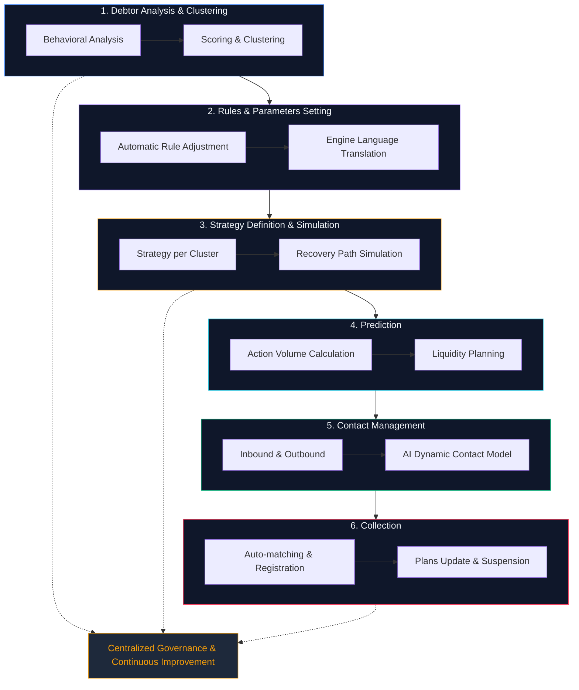

---

## 6. Document Flow Across Departments

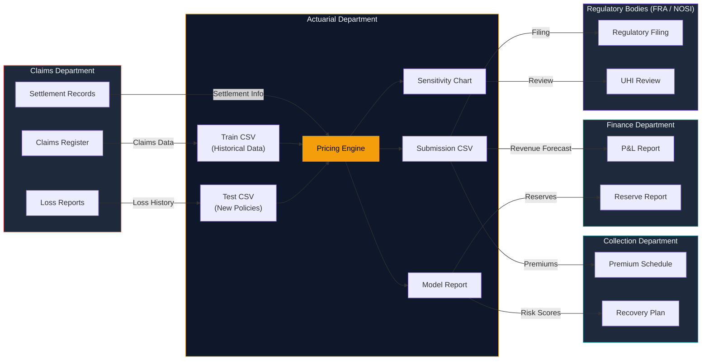

### Document Registry

| # | Document | Format | Source | Destination | Purpose |
|---|----------|--------|--------|-------------|---------|
| 1 | Claims Register | Internal DB | Claims Dept. | Actuarial Dept. | Historical claims record |
| 2 | Loss Reports | PDF / CSV | Claims Dept. | Actuarial Dept. | Detailed loss reports |
| 3 | Train CSV | `.csv` | Actuarial Dept. | Pricing Engine | Model training data |
| 4 | Test CSV | `.csv` | Actuarial Dept. | Pricing Engine | New policies for pricing |
| 5 | Model Performance Report | On-screen | Pricing Engine | Actuary | RMSE, MAE, R² per model |
| 6 | Sensitivity Chart | On-screen | Pricing Engine | CFO / Board | Parameter impact analysis |
| 7 | Submission CSV | `.csv` | Pricing Engine | FRA / Collection | Final premium per policy |
| 8 | Premium Schedule | CSV / PDF | Actuarial Dept. | Collection Dept. | Due premium schedule |
| 9 | Reserve Report | PDF | Actuarial Dept. | Finance Dept. | Reserves report |
| 10 | Regulatory Filing | CSV | Actuarial Dept. | FRA / NOSI | Mandatory regulatory reports |

---

## 7. User Experience Flow

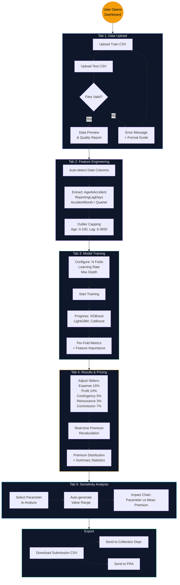

---

## 8. Stakeholder Interaction Map

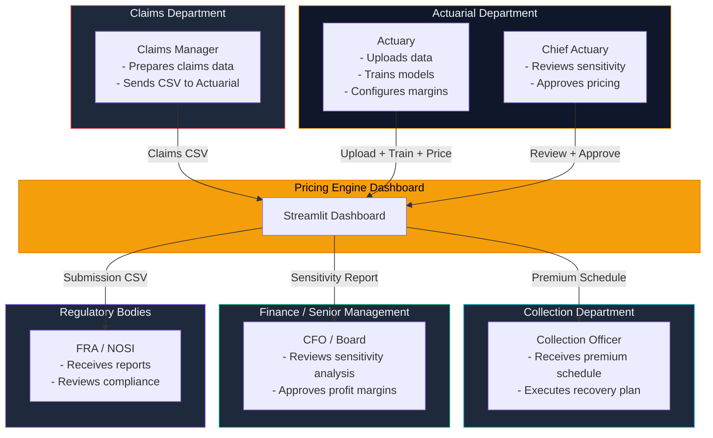

---

## 9. Pricing Logic Flow

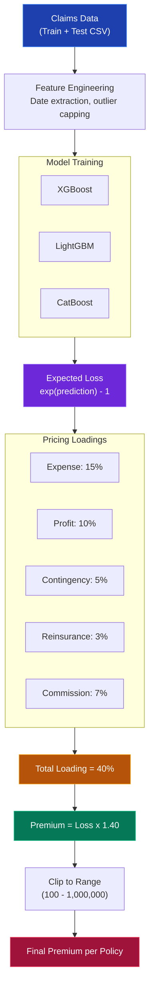

---

## 10. Technical Requirements

### 9.1 Software Stack

| Component | Version | Purpose |
|-----------|---------|---------|
| Python | 3.8+ | Runtime |
| Streamlit | Latest | Web Dashboard UI |
| XGBoost | Latest | Gradient Boosting |
| LightGBM | Latest | Light Gradient Boosting |
| CatBoost | Latest | Categorical Boosting |
| Pandas / NumPy | Latest | Data Processing |
| Scikit-learn | Latest | Cross-validation & Metrics |
| Matplotlib / Plotly | Latest | Visualization |

### 9.2 Data Requirements

| Requirement | Specification |
|------------|---------------|
| File Format | CSV (UTF-8) |
| Minimum Rows | 1,000+ claims |
| Target Column | `UltimateIncurredClaimCost` |
| Date Columns | `DateOfBirth`, `DateOfAccident`, `DateReported` |
| Missing Values | Native handling (-999 sentinel) |

### 9.3 Infrastructure

| Component | Minimum | Recommended |
|-----------|---------|-------------|
| CPU | 2 cores | 4+ cores |
| RAM | 4 GB | 8+ GB |
| Storage | 500 MB | 2 GB |
| GPU | Not required | Not required |

### 9.4 Team Requirements

| Role | Count | Responsibility |
|------|-------|---------------|
| Data Scientist | 1 | Model tuning & data preparation |
| Actuary | 1 | Pricing calibration & validation |
| Claims Analyst | 1 | Data extraction from claims system |
| IT Support | 1 | Deployment & maintenance |

---

## 11. Implementation Timeline

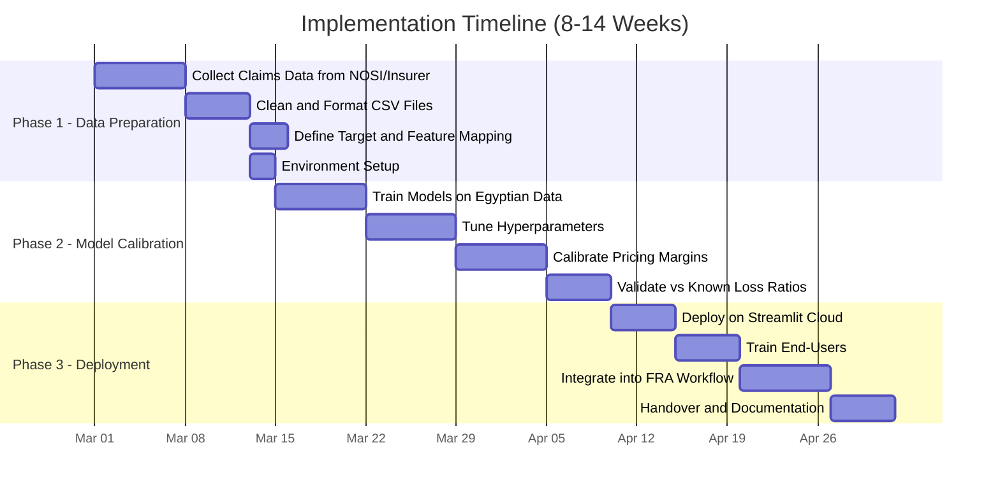

---

## 12. Risk Register

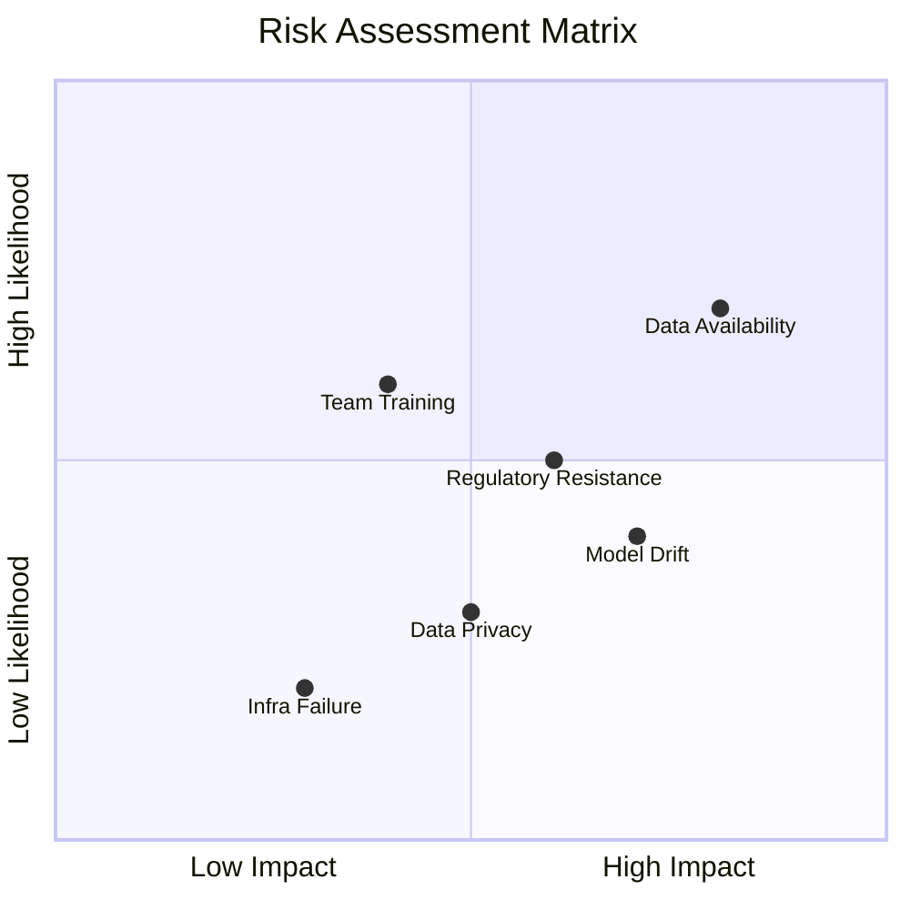

| Risk | Impact | Likelihood | Mitigation |
|------|--------|-----------|------------|
| Data Availability | High | High | Partner with NOSI for digitized claims extract |
| Regulatory Resistance | Medium | Medium | FRA Sandbox + transparent ML outputs |
| Team Training | Medium | Medium | 2-day workshop + video documentation |
| Infrastructure | Low | Low | Free Streamlit Cloud deployment |
| Model Drift | High | Medium | Quarterly retrain + monitoring alerts |
| Data Privacy | Medium | Low | On-premise processing, no PII in exports |

---

## 13. Regulatory Compliance Checklist

- [x] Supports Egyptian UHI **Law 2/2018** mandatory actuarial review
- [x] Produces downloadable CSV for FRA submission
- [x] Transparent ML model — feature importance visible
- [x] Configurable pricing margins — auditable loadings
- [x] Handles Egyptian date formats and local data standards
- [ ] Data encryption at rest (requires deployment configuration)
- [ ] Role-based access control (future enhancement)
- [ ] Audit trail logging (future enhancement)
