# Code Architecture & Valuation Lifecycle

This document explains the technical structure of the **UHI Actuarial Valuation Model**.

## 🔄 Actuarial Valuation Lifecycle

This diagram uses **Color Coding** to distinguish between roles and customizable modules:

```mermaid
graph TD
    classDef client fill:#FFF4E5,stroke:#FFA500,stroke-width:2px;
    classDef core fill:#E1F5FE,stroke:#1E90FF,stroke-width:2px;
    classDef decision fill:#E8F5E9,stroke:#32CD32,stroke-width:2px;

    Pop[📊 Population Structure Upload]:::client --> BaseMetrics(Calculate Base Contributions/Costs):::core
    
    subgraph Engine["Actuarial Valuation Engine"]
        Projection[Multi-year Projection Loop]:::core
        Inflation[Apply Wage & Medical Inflation]:::core
        Reserves[Calculate Technical Reserves]:::core
    end
    
    BaseMetrics --> Engine
    Assumptions[⚙️ Economic Assumptions]:::client --> Engine
    
    Engine --> Solvency{🏛️ Solvency Review}:::decision
    
    Solvency -->|Solvent| Surplus[Grow Reserve Fund]:::decision
    Solvency -->|Insolvent| Deficit[State Subsidy Warning]:::decision
    
    class Pop,Assumptions client;
    class BaseMetrics,Projection,Inflation,Reserves core;
    class Solvency,Surplus,Deficit decision;
```

- ■ **Policy/Economic Inputs** (Dashboard Sliders)
- ■ **Valuation Engine** (Multi-year projection logic)
- ■ **Solvency Metrics** (Decision support outputs)

## Detailed Component Interaction

### 1. Data Flow
1.  **Configuration**: `UHISystemConfig` captures economic parameters (inflation, investment rates).
2.  **Processing**: `ActuarialValuationEngine` iterates through the projection horizon (e.g., 20 years).
3.  **Calculation**: 
    - **Revenues**: Aggregated law-mandated contributions.
    - **Expenditure**: Medical costs projected using exponential growth: $Cost_t = Cost_0 \times (1 + i)^t$.

### 2. Session State Persistence
Streamlit's `st.session_state` stores:
- `st.session_state.population_df`: The current population demographics.
- `last_year`: The calculated solvency position used for top-level KPIs.

---

## File Responsibilities

| File | Role | Key Components |
| :--- | :--- | :--- |
| **[app.py](file:///C:/Users/Ahmed/OneDrive%20-%20Konecta/Documents/mcp/actuarial-loss-estimation/app.py)** | **Strategic Dashboard** | Side-bar assumptions, Solvency and Reserve fund charts. |
| **[pricing_engine.py](file:///C:/Users/Ahmed/OneDrive%20-%20Konecta/Documents/mcp/actuarial-loss-estimation/pricing_engine.py)** | **Valuation Engine** | `UHISystemConfig`, `ActuarialValuationEngine`, `project_solvency`. |

> [!TIP]
> The engine handles **Investment Returns** automatically, making it a critical tool for identifying the "Crossover Point" where medical inflation might outpace wage growth.
