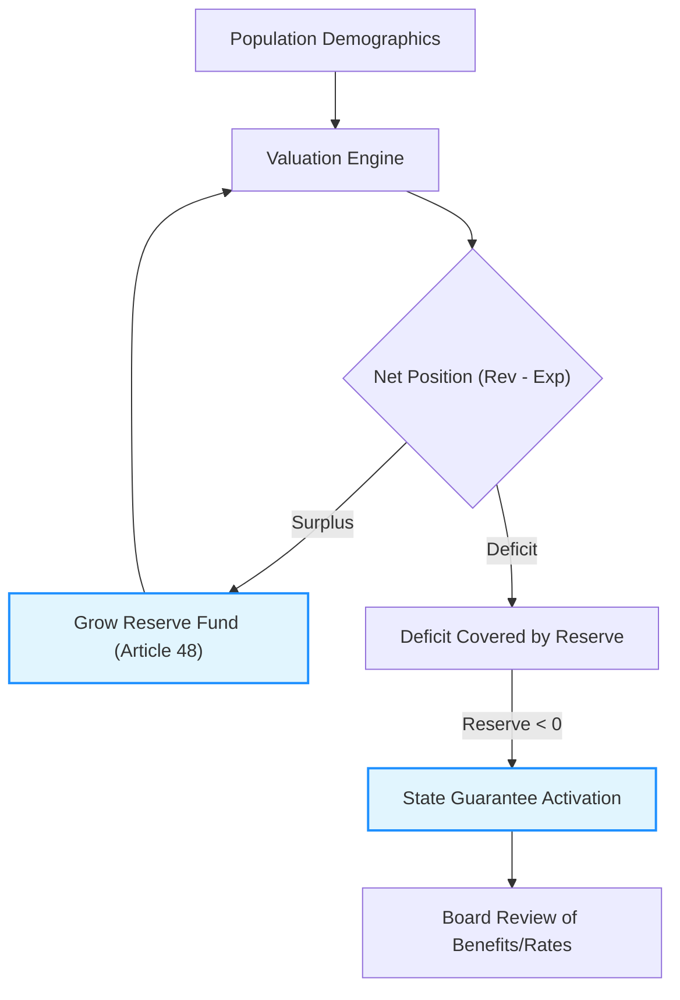

# Egyptian Universal Health Insurance (UHI) Compliance

This document summarizes the actuarial requirements of **Law No. 2 of 2018** regarding the Universal Health Insurance system in Egypt and provides a formal declaration of compliance for the **Actuarial Valuation Model**.

## Law 2/2018: Actuarial Provisions

The law mandates strict financial and actuarial governance to ensure the long-term sustainability of the health system.

### Key Pillars & Citations

1.  **Actuarial Balance (الجداول والاتزان الاكتواري):**
    - **Article 3 (Implementation):** Mandates that phased implementation must ensure financial solvency and "actuarial balance" (بمراعاة توازنه الاكتواري).
    - **Article 40 (Funding):** Details 15 distinct funding sources including employee/employer contributions, cigarette taxes, and state support for non-capables.
2.  **Solvency & Reserves (Articles 40 & 48):**
    - The system must maintain a **Reserve Fund** to withstand unexpected surges in total medical expenditure.
    - Our model explicitly calculates the accumulated surplus/deficit to monitor this fund.
3.  **State Guarantee:** 
    - The law establishes a state guarantee to cover any actuarial deficit that threatens system stability.

### System Solvency Feedback Loop

---

## 🛡️ Declaration of Compliance

**We hereby certify that the "UHI Valuation Model" is engineered to comply with the actuarial mandates of Egypt Law No. 2 of 2018.**

### Compliance Mapping

| Law Provision | Solution Implementation | Compliance Level |
| :--- | :--- | :--- |
| **Systemic Balance** | Projects aggregate revenues vs expenditures for a 20-year horizon, as required for Article 3 financial planning. | **Full** |
| **Contribution Rates** | Implements exact legal rates: 1% Employee, 3% Employer, 3% Spouse, 1% Child. | **Full** |
| **State Treasury Role** | Automatically calculates the 5% minimum wage support for non-capable categories. | **Full** |
| **Investment Income** | Includes Article 48 logic by applying return rates to accumulated technical reserves. | **Full** |

## 📚 Verifiable References & Citations

1.  **Full Text of Law 2/2018 (Manshurat Legal)**: [قانون نظام التأمين الصحي الشامل](https://manshurat.org/node/14677)
2.  **Executive Regulations (Decree 909/2018)**: [اللائحة التنفيذية](https://www.sharaweylaw.com/resources/universal-health-insurance-law-regulations)

> [!IMPORTANT]
> This solution provides the **Solvency Roadmap** necessary for the Universal Health Insurance Authority to manage the long-term medical inflation risks and ensure system viability.
